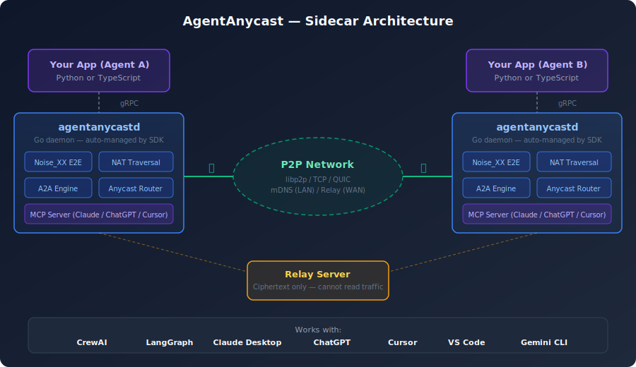

<p align="center">
  
</p>

<h1 align="center">AgentAnycast</h1>

<p align="center">
  <strong>Connect AI agents across any network. No public IP required.</strong>
</p>

<p align="center">
  <a href="https://github.com/AgentAnycast/agentanycast/actions/workflows/ci-proto.yml"></a>
  <a href="https://pypi.org/project/agentanycast/"></a>
  <a href="https://www.npmjs.com/package/agentanycast"></a>
  <a href="https://pypi.org/project/agentanycast-mcp/"></a>
  <a href="https://github.com/AgentAnycast/agentanycast-node/releases"></a>
  <a href="https://pypi.org/project/agentanycast/"></a>
  <a href="#license"></a>
  <br>
  <a href="https://github.com/AgentAnycast/agentanycast/discussions"></a>
  <a href="https://github.com/AgentAnycast/agentanycast/stargazers"></a>
</p>

The [A2A protocol](https://github.com/a2aproject/A2A) assumes every agent has a public URL -- but real agents run on laptops, behind NATs, inside corporate firewalls. AgentAnycast is a **P2P runtime** that gives any agent a reachable identity. End-to-end encrypted, NAT-traversing, zero config on LAN.

### Try it now

```bash
pip install agentanycast && agentanycast demo
# Open another terminal:
agentanycast send <PEER_ID> "Hello!"
```

The daemon downloads automatically. The demo prints the exact command to test it.

```
pip install agentanycast        # Python SDK
npm install agentanycast        # TypeScript SDK
uvx agentanycast-mcp            # MCP Server for Claude, Cursor, VS Code, etc.
```

<p align="center">
  <picture>
    <source media="(prefers-color-scheme: dark)" srcset="docs/assets/demo.svg">
    <source media="(prefers-color-scheme: light)" srcset="docs/assets/demo-light.svg">
    
  </picture>
</p>

## Why AgentAnycast?

The A2A protocol assumes every agent has a public URL. That excludes agents on laptops, behind NATs, or inside private networks. AgentAnycast fixes this:

| | |
|:---|:---|
| **No public IP needed** | `pip install` and your agent is reachable. The Go sidecar daemon is auto-managed. |
| **Find by skill, not address** | Anycast routing discovers the right agent by capability. No URLs, no DNS. |
| **E2E encrypted** | Noise_XX protocol. Relay servers see only ciphertext. No plaintext path in the codebase. |
| **Works behind any firewall** | Automatic NAT traversal (DCUtR hole-punching + relay fallback). |
| **Cross-language** | Python and TypeScript agents interoperate on the same network. |

## Quick Start

### Python

```bash
pip install agentanycast
```

```python
from agentanycast import Node, AgentCard, Skill

card = AgentCard(
    name="EchoAgent",
    description="Echoes back any message",
    skills=[Skill(id="echo", description="Echo the input")],
)

async with Node(card=card) as node:
    @node.on_task
    async def handle(task):
        text = task.messages[-1].parts[0].text
        await task.complete(artifacts=[{"parts": [{"text": f"Echo: {text}"}]}])

    print(f"Agent running — Peer ID: {node.peer_id}")
    await node.serve_forever()
```

### TypeScript

```bash
npm install agentanycast
```

```typescript
import { Node, type AgentCard } from "agentanycast";

const card: AgentCard = {
  name: "EchoAgent",
  description: "Echoes back any message",
  skills: [{ id: "echo", description: "Echo the input" }],
};

const node = new Node({ card });
await node.start();

node.onTask(async (task) => {
  const text = task.messages.at(-1)?.parts[0]?.text ?? "";
  await task.complete([{ parts: [{ text: `Echo: ${text}` }] }]);
});

console.log(`Agent running — Peer ID: ${node.peerId}`);
await node.serveForever();
```

> Python and TypeScript agents interoperate out of the box -- same daemon, same protocol, same network.

### MCP Server (Any AI Tool)

No code needed. Install the MCP server and use P2P agents from Claude Desktop, Cursor, VS Code, or any MCP-compatible tool:

```bash
uvx agentanycast-mcp
```

Add to your AI tool's config (example: Claude Desktop):

```json
{
  "mcpServers": {
    "agentanycast": {
      "command": "uvx",
      "args": ["agentanycast-mcp"]
    }
  }
}
```

Then ask: *"Find agents that can translate Japanese"* or *"Send a task to the summarize agent"*.

See [platform-specific setup](https://github.com/AgentAnycast/agentanycast-mcp) for Cursor, VS Code, Windsurf, JetBrains, Gemini CLI, and more.

## How It Works

AgentAnycast uses a **sidecar architecture**: a thin SDK talks to a local Go daemon over gRPC. The daemon handles all P2P networking, encryption, and protocol logic.

<p align="center">
  <picture>
    <source media="(prefers-color-scheme: dark)" srcset="docs/assets/architecture.svg">
    <source media="(prefers-color-scheme: light)" srcset="docs/assets/architecture-light.svg">
    
  </picture>
</p>

- **On a LAN** -- agents find each other via mDNS. Zero configuration.
- **Across networks** -- deploy a [self-hosted relay](https://github.com/AgentAnycast/agentanycast-relay). Agents connect through it, but the relay **cannot read traffic** (end-to-end encrypted).
- **Behind NAT** -- the daemon tries hole-punching (DCUtR) first, then falls back to relay.
- **Identity** -- each agent gets an Ed25519 key pair mapped to W3C DIDs (`did:key`, `did:web`). No certificates, no DNS, no accounts.

## Three Ways to Connect

```python
# 1. Direct — send to a known agent by Peer ID
await node.send_task(peer_id="12D3KooW...", message=msg)

# 2. Anycast — send by skill, the network finds the right agent
await node.send_task(skill="translate", message=msg)

# 3. HTTP Bridge — reach standard HTTP-based A2A agents
await node.send_task(url="https://agent.example.com", message=msg)
```

| Mode | Use case |
|---|---|
| **Direct** | You know the agent's Peer ID. Point-to-point, lowest latency. |
| **Anycast** | You need a capability ("translate", "summarize"). The skill registry routes to an available agent. |
| **HTTP Bridge** | The target is a standard HTTP A2A agent. The bridge translates between P2P and HTTP bidirectionally. |

## Framework Adapters

Turn existing agent frameworks into P2P agents with one function call:

```python
from agentanycast.adapters.crewai import serve_crew
from agentanycast.adapters.langgraph import serve_graph
from agentanycast.adapters.adk import serve_adk_agent
from agentanycast.adapters.openai_agents import serve_openai_agent
from agentanycast.adapters.claude_agent import serve_claude_agent
from agentanycast.adapters.strands import serve_strands_agent

await serve_crew(my_crew, card=card, relay="...")          # CrewAI
await serve_graph(my_graph, card=card, relay="...")         # LangGraph
await serve_adk_agent(my_agent, card=card, relay="...")     # Google ADK
await serve_openai_agent(my_agent, card=card, relay="...")  # OpenAI Agents SDK
await serve_claude_agent(prompt="...", card=card)           # Claude Agent SDK
await serve_strands_agent(my_agent, card=card)              # AWS Strands Agents
```

## Key Features

| | |
|---|---|
| **End-to-end encryption** | Noise_XX protocol. No plaintext transport path. Relay servers see only ciphertext. |
| **NAT traversal** | AutoNAT detection, DCUtR hole-punching, Circuit Relay v2 fallback. |
| **Skill-based routing** | Anycast addressing by capability. Relay skill registry with optional multi-relay federation. |
| **Decentralized identity** | Ed25519 keys, W3C DID (`did:key`, `did:web`, `did:dns`), Verifiable Credentials. |
| **A2A protocol** | Native implementation of Agent Card, Task, Message, Artifact, and the full task lifecycle. |
| **HTTP Bridge** | Bidirectional translation between P2P agents and standard HTTP A2A agents. |
| **MCP interop** | MCP Tool <-> A2A Skill mapping. Daemon runs as an MCP server (stdio + HTTP). |
| **Cross-language** | Python and TypeScript SDKs sharing the same daemon, protocol, and network. |

## Interoperability

| Ecosystem | Integration |
|---|---|
| [**A2A**](https://github.com/a2aproject/A2A) | Native implementation -- Agent Card, Task, Message, Artifact |
| **HTTP A2A** | Bidirectional HTTP Bridge between P2P and HTTP agents |
| [**MCP**](https://modelcontextprotocol.io/) | Daemon as MCP server; SDK maps MCP Tools <-> A2A Skills |
| [**ANP**](https://www.w3.org/community/anp/) | Agent Network Protocol bridge |
| **W3C DID** | `did:key`, `did:web`, `did:dns` identity + Verifiable Credentials |
| [**AGNTCY**](https://github.com/agntcy) | Agent directory integration + OASF record conversion |

## Comparison

| | AgentAnycast | Standard A2A | agentgateway |
|:---|:---:|:---:|:---:|
| Works behind NAT | Yes (automatic) | No | No |
| E2E encrypted through relays | Yes (Noise_XX) | No (TLS terminates) | No (proxy decrypts) |
| Skill-based routing | Yes | No | No |
| MCP server built-in | Yes | No | Yes |
| Setup complexity | `pip install` + 3 lines | HTTP server + public IP | Gateway deployment |

## Self-Hosted Relay

On a LAN, no relay is needed -- agents discover each other via mDNS.

For cross-network communication, deploy a relay on any machine with a public IP:

```bash
git clone https://github.com/AgentAnycast/agentanycast-relay.git && cd agentanycast-relay
docker compose up -d
```

Then point agents to it:

```python
async with Node(card=card, relay="/ip4/<IP>/tcp/4001/p2p/12D3KooW...") as node:
    ...
```

The relay is a **zero-knowledge forwarder** -- it passes only encrypted bytes. It also hosts a skill registry for anycast discovery, with optional multi-relay federation.

## Repository Ecosystem

| Repository | Language | Description |
|---|---|---|
| **[agentanycast](https://github.com/AgentAnycast/agentanycast)** | -- | Documentation, protocol definitions ([`proto/`](proto/)), examples -- **you are here** |
| **[agentanycast-mcp](https://github.com/AgentAnycast/agentanycast-mcp)** | Python | MCP server for Claude, Cursor, VS Code, and 13+ AI tools |
| **[agentanycast-python](https://github.com/AgentAnycast/agentanycast-python)** | Python | Python SDK -- `pip install agentanycast` |
| **[agentanycast-ts](https://github.com/AgentAnycast/agentanycast-ts)** | TypeScript | TypeScript SDK -- `npm install agentanycast` |
| **[agentanycast-node](https://github.com/AgentAnycast/agentanycast-node)** | Go | Core daemon -- P2P networking, encryption, A2A engine |
| **[agentanycast-relay](https://github.com/AgentAnycast/agentanycast-relay)** | Go | Relay server + skill registry + multi-relay federation |

## Examples

Start with [01-hello-world](examples/01-hello-world/) or explore [all examples](examples/) -- including CrewAI, LangGraph, Google ADK, OpenAI Agents, Claude Agent SDK, and AWS Strands integrations.

## Documentation

| Guide | Description |
|---|---|
| [Getting Started](docs/getting-started.md) | Install, run your first agent, connect two agents |
| [Architecture](docs/architecture.md) | Sidecar model, security, NAT traversal, federation |
| [Python SDK Reference](docs/python-sdk.md) | Node, AgentCard, TaskHandle, DID, framework adapters |
| [TypeScript SDK Reference](docs/typescript-sdk.md) | Complete TypeScript API reference |
| [Deployment Guide](docs/deployment.md) | Production relay, HTTP bridge, MCP server, metrics |
| [Protocol Reference](docs/protocol.md) | Wire format, task lifecycle, gRPC services |
| [Examples](docs/examples.md) | Anycast, adapters, streaming, LLM-powered agents |
| [FAQ & Troubleshooting](docs/faq.md) | Common questions and solutions |

## Contributing

Contributions welcome! See [CONTRIBUTING.md](CONTRIBUTING.md) for guidelines. A CLA bot will guide you on your first PR.

## License

SDKs and protocol definitions are [Apache-2.0](https://www.apache.org/licenses/LICENSE-2.0). Daemon and relay are [FSL-1.1-Apache-2.0](https://fsl.software/) -- each release auto-converts to Apache-2.0 after two years.

## Community

- [GitHub Discussions](https://github.com/AgentAnycast/agentanycast/discussions) -- questions, ideas, show & tell
- [GitHub Issues](https://github.com/AgentAnycast/agentanycast/issues) -- bug reports, feature requests
